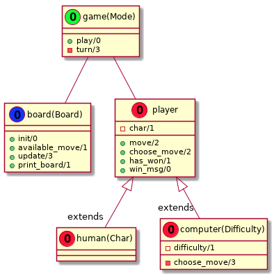

# TicTacToeTalk

 [Coverage Report](https://logtalk-actions.github.io/demo/coverage_report.html)


A console TicTacToe game in Logtalk, which you play against the
computer.

## How to play

Launch Logtalk and load the game:

```
?- {loader}.
```

Then you have a choice of difficulties:

```
?- game(easy)::play.
```
or
```
?- game(hard)::play.
```
or you can play against another human:
```
?- game('2p')::play.
```

In an easy game the computer makes random moves. In the hard game it
uses a smart strategy to actively try and win, but not so smart that
it's impossible to win!

## Portability

Due to the use of non-ASCII characters to draw the board, the current
version requires a backend that supports UTF-8 encoding. The game can
currently be played on CxProlog, SICStus Prolog, SWI-Prolog, and YAP.

## Design

We've tried to keep this a relatively simple but comprehensive example.
So for the OO we're only using objects, parametric objects, and a couple
of extensions. A high-level view of the design:



However, we've also made an effort to include documentation and unit
tests to demonstrate the utility of the Logtalk ecosystem, hence the
badges above.
